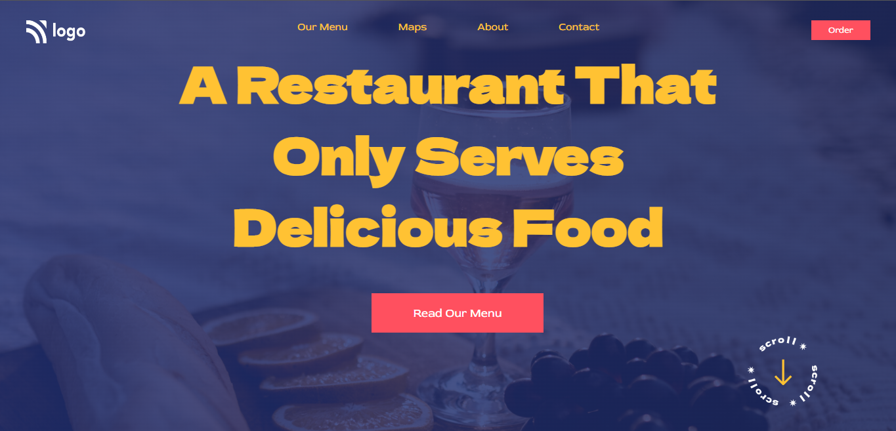

# Food Restaurant | Project-2
#### by Ritam Mishra
### Tech That I use 
  

 

***

(Live Preview)(https://food-restaurant-project-2.netlify.app/)
***
## What I learn from this project
- How to add background image.
- How to position any element.
- How to adjust padding.
- How add linear gradient.
- How make a Button

## Time to Complete
- It's takes near about 3 Hrs.
